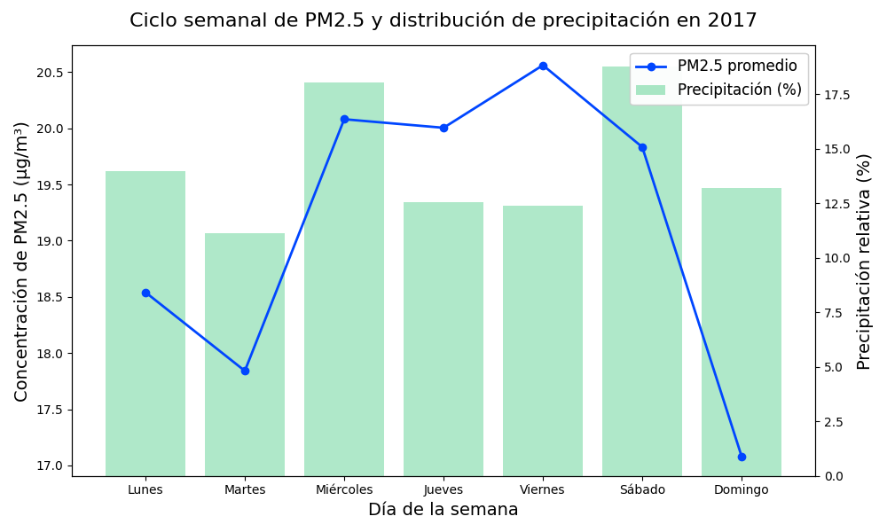

# 🌍 Análisis de Calidad del Aire en 2017 - Estación 38

📊 Proyecto de análisis y visualización de datos de calidad del aire de una estación urbana durante el año **2017**, con énfasis en el contaminante **PM2.5**.  
El objetivo es limpiar, validar y graficar los datos para identificar patrones diarios, mensuales y semanales, así como la relación con la precipitación.

---

## 📂 Contenido del repositorio

- `main.py` → Script principal con la carga, limpieza y graficación de los datos.
- `*.csv` → Archivos de datos horarios mensuales (enero–diciembre 2017).
- Gráficos generados:
  - 📈 `promedio_diario_pm25.png`
  - 📊 `promedio_mensual_pm25.png`
  - 📏 `promedio_anual_pm25.png`
  - 🕑 `ciclo_diurno_pm25.png`
  - 📅 `ciclo_semanal_pm25_precipitacion.png`

---

## 📈 Resultados visuales

### Promedio diario de PM2.5

### Promedio mensual de PM2.5

### Promedio anual de PM2.5

### Ciclo diurno de PM2.5

### Ciclo semanal de PM2.5 y precipitación

---

## ⚙️ Tecnologías utilizadas
- 🐍 **Python 3.13**
- 📦 **Pandas** – Procesamiento y limpieza de datos
- 📊 **Matplotlib** – Visualización de datos
- 🔍 **Numpy** – Cálculos numéricos

---

## 🎯 Objetivo
- Detectar y eliminar valores inválidos en los datos de calidad del aire.
- Evaluar excedencias respecto a las normativas ambientales.
- Visualizar patrones **diarios, mensuales y anuales** de concentración de PM2.5.
- Relacionar la variabilidad del contaminante con la **precipitación semanal**.

---

## 📜 Licencia
Este proyecto está bajo licencia MIT. Puedes usarlo y modificarlo libremente.
