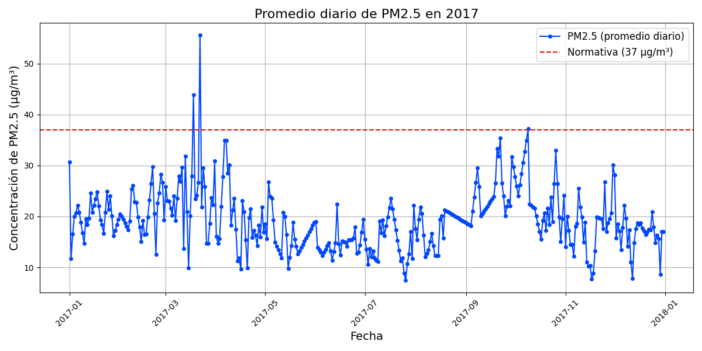
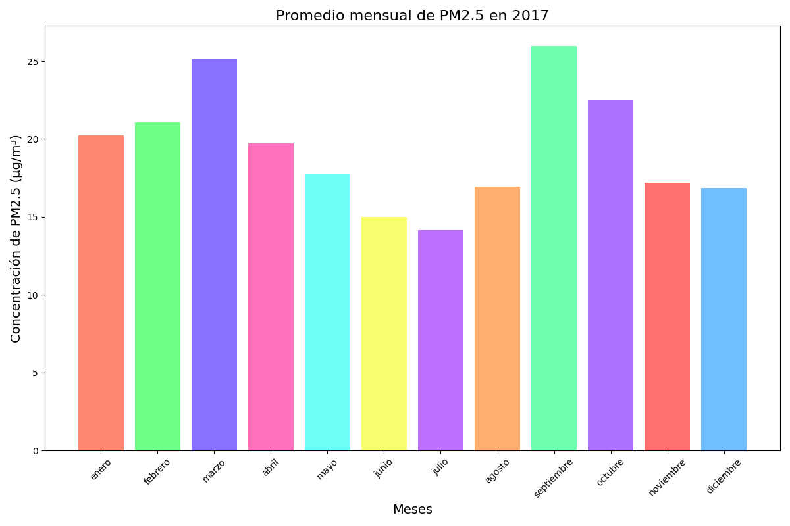
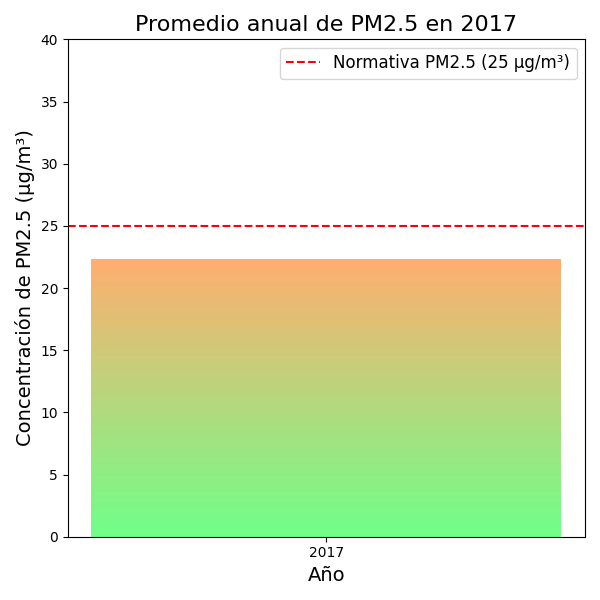
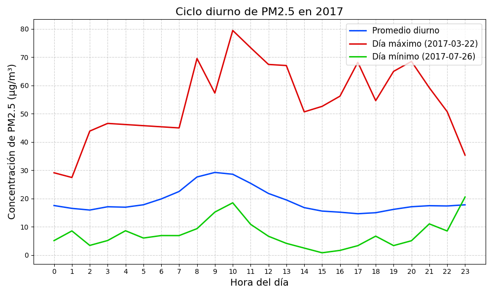
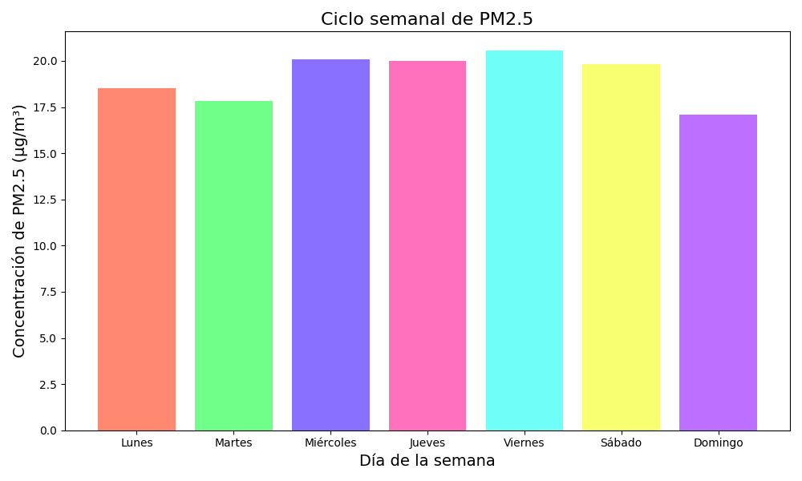
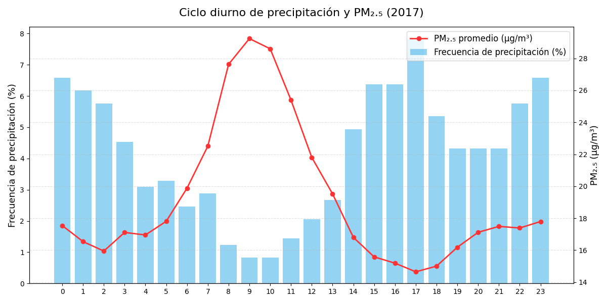
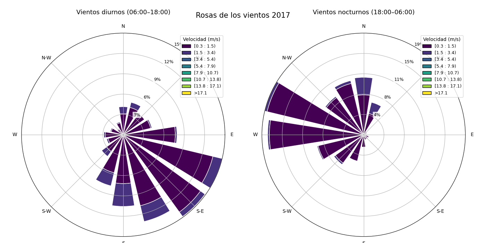
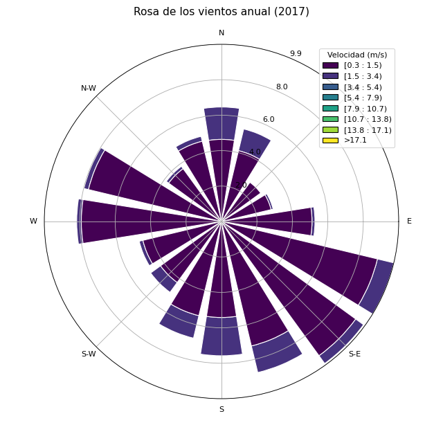
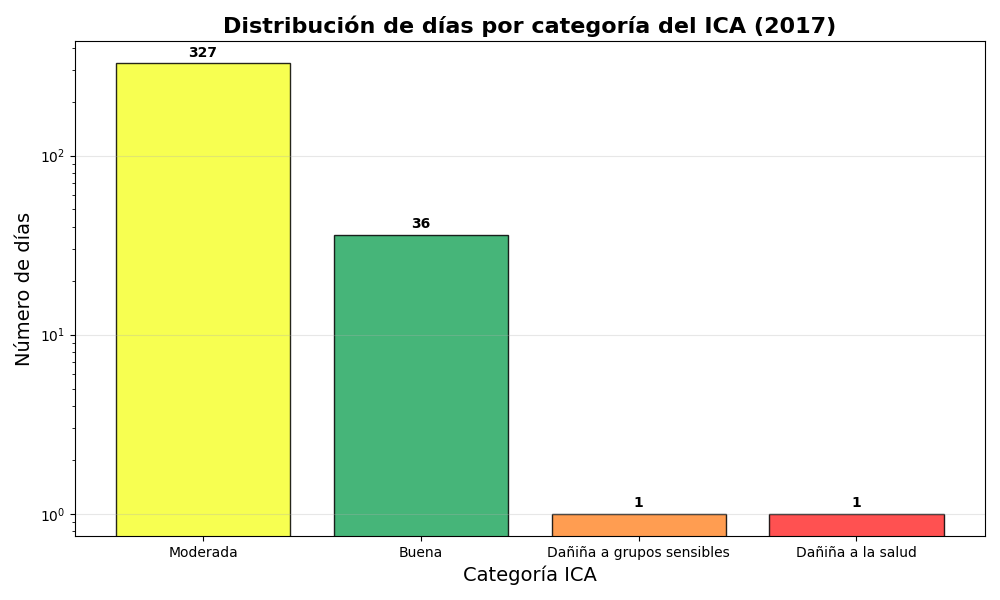
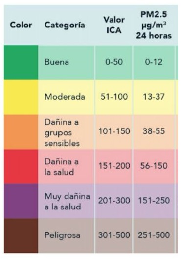

# 🌍 Análisis de Calidad del Aire en 2017 - Estación 38

📊 Proyecto de análisis y visualización de datos de calidad del aire de una estación urbana durante el año **2017**, con énfasis en el contaminante **PM2.5**.  
El objetivo es limpiar, validar y graficar los datos para identificar patrones diarios, mensuales y semanales, así como analizar el comportamiento del viento y su efecto sobre la dispersión de contaminantes.

---

## 📂 Contenido del repositorio

- `main.py` → Script principal con la carga, limpieza, ajuste a condiciones de referencia y visualización de los datos.
- `*.csv` → Archivos de datos horarios mensuales (enero–diciembre 2017).
- Gráficos generados:
  - 📈 `promedio_diario_pm25.png`
  - 📊 `promedio_mensual_pm25.png`
  - 📏 `promedio_anual_pm25.png`
  - 🕑 `ciclo_diurno_pm25.png`
  - 📅 `ciclo_semanal_pm25.png`
  - 🌬️ `rosa_vientos_dia_noche.png`
  - 🌧️ `ciclo_diurno_pm25_precipitacion.png`

---

## 📈 Resultados visuales

### Promedio diario de PM2.5

### Promedio mensual de PM2.5

### Promedio anual de PM2.5

### Ciclo diurno de PM2.5

### Ciclo semanal de PM2.5 

### Ciclo diurno de PM2.5 con frecuencia de precipitación

### Rosa de los vientos anual para día y noche

### Rosa de los vientos anual

### ICA en el año

### Calendario ICA Enero - Mayo

### Calendario ICA Septiembre - Diciembre

## 📈 Estadísticos básicos del ICA

| Estadístico | Valor | Descripción                                                                                        |
| :---: | :---: |:---------------------------------------------------------------------------------------------------|
| **count** | 365.0 | Número total de valores válidados.                                                                 |
| **mean** | 63.18 | Media aritmética de los valores de ICA.                                             |
| **std** | 12.62 | **Desviación Estándar**, que mide la dispersión promedio de los datos con respecto a la media.     |
| **min** | 31.0 | **Valor mínimo** encontrado en la serie.                                                           |
| **25%** | 55.0 | **Primer Cuartil (Q1)**. El 25% de los datos es menor o igual a este valor.                        |
| **50%** | 62.0 | **Mediana (Q2)**. El valor central de la serie, el 50% de los datos es menor o igual a este valor. |
| **75%** | 69.0 | **Tercer Cuartil (Q3)**. El 75% de los datos es menor o igual a este valor.                        |
| **max** | 150.0 | **Valor máximo** encontrado en la serie.                                                           |
---

## 📐 Fórmula ICA

$$
I_p = \frac{I_{Hi} - I_{Lo}}{BP_{Hi} - BP_{Lo}} \left( C_p - BP_{Lo} \right) + I_{Lo}
$$

**Donde:**

- $ I_p $ = Índice para el contaminante $ p $
- $ C_p $ = Concentración medida para el contaminante $ p $
- $ BP_{Hi} $ = Punto de corte mayor o igual a $ C_p $
- $ BP_{Lo} $ = Punto de corte menor o igual a $ C_p $
- $ I_{Hi} $ = Valor del Índice de Calidad del Aire correspondiente al $ BP_{Hi} $
- $ I_{Lo} $ = Valor del Índice de Calidad del Aire correspondiente al $ BP_{Lo} $

### [Manual de Operación](https://www.minambiente.gov.co/wp-content/uploads/2021/06/Protocolo_Calidad_del_Aire_-_Manual_Operacion.pdf)

---

### Valores Empleados en el cáculo del ICA

### [Puntos de corte del ICA - AMVA ](https://www.metropol.gov.co/ambiental/calidad-del-aire/informes_red_calidaddeaire/Informe-Anual-Aire-2021.pdf)

## ⚙️ Tecnologías utilizadas
- 🐍 **Python 3.13**
- 📦 **Pandas** – Procesamiento y limpieza de datos
- 📊 **Matplotlib** – Visualización de datos
- 🌪️ **Windrose** – Representación de direcciones y velocidades del viento
- 🔍 **Numpy** – Cálculos numéricos
---

## 🎯 Objetivos del proyecto
- Detectar y reemplazar valores inválidos en las variables ambientales sin eliminar filas completas.
- Ajustar la concentración de PM2.5 a **condiciones de referencia** a partir de **condiciones locales de temperatura y presión** (25 °C y 1 atm).
- Visualizar patrones **diarios, mensuales y anuales** de PM2.5.
- Relacionar la variabilidad del contaminante con la **frecuencia de precipitación** y la **dispersión del viento** mediante la rosa de los vientos.

---

## 📜 Licencia
Este proyecto está bajo licencia MIT. Puedes usarlo y modificarlo libremente.
